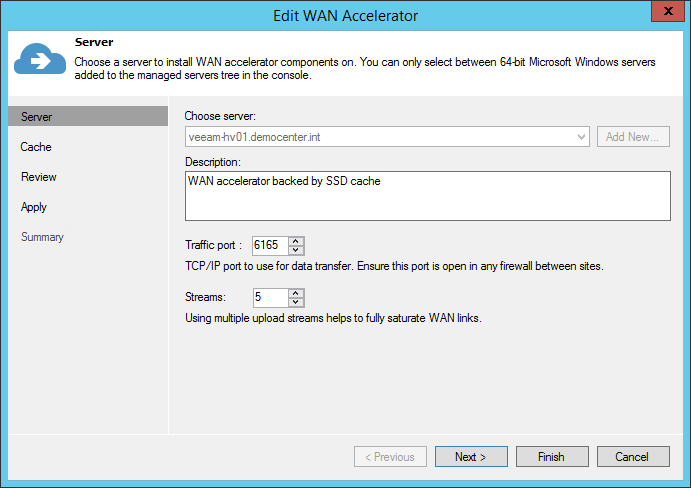
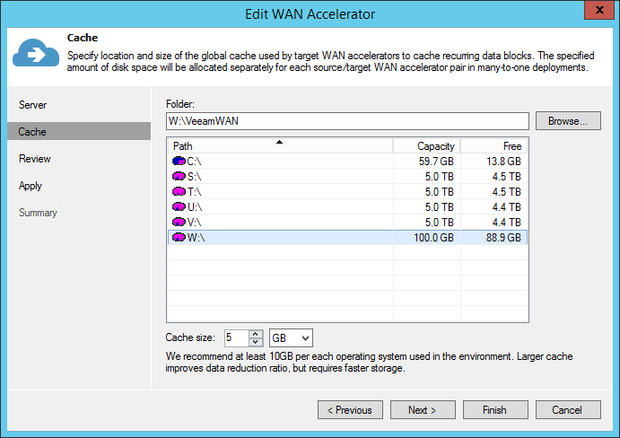

## Configuration

As the source WAN accelerator can only process one task at a time (one VM disk in a backup copy job or replication job), you may need to deploy multiple WAN accelerator pairs to meet the performance demands.

The target WAN accelerator can handle multiple incoming streams (as described in the [Many-to-One WAN Acceleration](https://helpcenter.veeam.com/docs/backup/vsphere/wan_acceleration_many.html?ver=95) section of the User Guide), it is recommended to maintain a 4:1 ratio
between the number of source WAN accelerators per target WAN accelerator.

This guideline is very much dependent on the WAN link speed. Many source sites with low bandwidth will create little pressure on the target WAN accelerator. So, for instance, in multiple ROBO configurations a 10:1 ratio can be considered.

If there are sites with  high bandwidth (such as datacenter-to-datacenter replication), they will produce a much more significant load on both the target WAN accelerator and the target repository due to the second data block lookup (for more information, refer to the [User Guide](https://helpcenter.veeam.com/docs/backup/vsphere/wan_acceleration_sources.html?ver=95)).

**Note:** The secondary data block lookup is used, when a data block is not available in the WAN accelerator cache. When there is a WAN cache “miss”, the secondary lookup for the same data block is performed on the target repository. If it is found here, it is read back to the WAN accelerator instead of re-transmitting over WAN.

Assuming the source and target repositories can
deliver the throughput required for the optimal processing rate, use the guidelines that follow.

**Note:** The numbers below are processing rates. The WAN link usage is dependent on the achieved data reduction ratio.

-   Average throughput per target WAN accelerator: 500 Mbit/s (62.5 MB/s)

-   Depending on the achieved data reduction rate (typically 10x), the transfer rate over the WAN link will vary.

    -   If the processing rate is 62.5 MB/s, and the data reduction rate is 10x, then it is possible to sustain 6.25 MB/s (50 Mbit/s) over the WAN link.

    -   If the WAN link has high bandwidth (above 100Mbps) consider using backup copy jobs without WAN Acceleration. However, if you use WAN accelerators in that scenario, it may require deployment of multiple WAN accelerator to fully saturate the WAN link.

[^1]: A pair of WAN accelerators means any source WAN accelerator paired with the target WAN accelerator.

**Configuring number of streams**

*Thanks to our friends at PernixData for helping with I/O analysis using PernixData Architect.*
When configuring the WAN accelerator, not all configuration parameters affect both source and target WAN accelerators. In this section we will highlight what settings should be considered on each side.

**Source WAN Accelerator**

At the first step of the WAN accelerator configuration wizard, you can change the default setting of five TCP threads. This setting applies to the source WAN accelerator only and is automatically configured to mirror the number on the target WAN accelerator at the beginning of each job. This ensures different source WAN accelerators can have different settings when using the same target WAN accelerator at different times. The maximum setting is 100 simultaneous threads for throughput optimization and compensation for high latency or packet loss.

If the link has low latency and high bandwidth, the default setting (5 streams) may be enough to fully saturate it. If the link is still not saturated, the number of streams may be increased accordingly.
Testing shows that with high latency links, **link speed x 1.5** is a good best practice for estimating the number of streams required. Below is an example benchmark on a 10 Mbit/s WAN link with 100 milliseconds of latency.

| Link (Mbit/s) | Latency (ms) | Packet loss (%) | Streams | Throughput (Mbps) |
|:--------------|:-------------|:----------------|:--------|:------------------|
| 10            | 100          | 0               | 3       | 3.5               |
| 10            | 100          | 0               | 10      | 7.5               |
| **10**        | **100**      | **0**           | **15**  | **10**            |
| 10            | 100          | 0               | 20      | 10                |

Increasing the number of streams to more than required for fully saturating the link will cause initialization of data transfers to slow down, as the data transfer will wait for all streams to initialize and stabilize before beginning to  transfer any data.
**Tip**: To test different scenarios in the lab before deploying WAN acceleration, you can use a WAN emulator (such as [WANem](http://wanem.sourceforge.net/)).

When configuring the cache location for the source WAN accelerator, consider that the actual cache size on the source is irrelevant, as it is used only for digest files (where block hashes are stored). However, if a WAN accelerator will be used for bi-directional acceleration (act as both source and target), follow the guidelines provided in the "Target WAN Accelerator" section.

Traffic throttling rules should be created in both directions. See Network Traffic Throttling and Multithreaded Data Transfer for more information.

