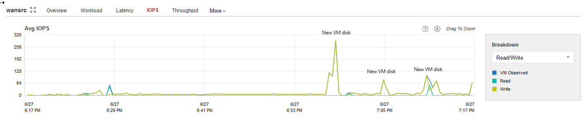
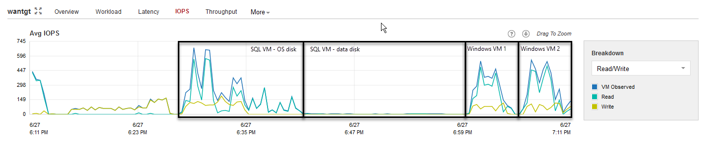
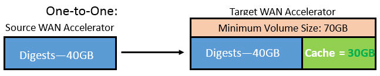

# Veeam WAN Accelerator

By combining multiple technologies such as network compression, multi-threading, dynamic TCP window size, variable block size deduplication and global caching, WAN acceleration provides sufficient capability when the network bandwidth is low or limited when performing Backup Copy and Replication jobs. This technology is specifically designed to accelerate Veeam job. Any other WAN acceleration technology should be disabled for Veeam traffic.

## WAN Accelerator Placement
WAN accelerators work in pairs: one WAN accelerator should be deployed at the source side and another at the target site. Many to one scenario is also possible but needs accurate sizing and has higher system requirements.

**How many source WAN accelerators do I need ?**

Since WAN accelerator processes VM disk sequentially, you may consider using more than one source WAN accelerators to distribute tasks between them. Many-to-one scenario is supported, target WAN accelerator should be sized carefully in this case with recommended ratio 4:1.

## Source WAN Accelerator System requirements

The source WAN accelerator consumes a high amount of CPU and memory whilst re-applying the WAN optimized compression algorithm. Recommended system configuration is 4 CPU cores and 8 GB RAM. When using an existing Veeam Managed Server for Wan Acceleration which already has a role such as Veeam Backup & Replication Server, Proxy or Windows Repository ensure you have not overcommitted the CPUs on that host and there is enough resource for each role, otherwise the job will wait for a free CPU to continue.
The I/O requirements for the source WAN accelerator spikes every time a new VM disk starts processing, so the typical I/O pattern is made of many small blocks. Thus, it is recommended to deploy WAN accelerators on disk configurations with decent I/O performance, avoiding high latency spinning disks.

*Source WAN accelerator IOPS*

## Source WAN Accelerator Sizing

**Disk Size**

Source WAN accelerator stores only the digests of the processed VM OS data blocks in the *VeeamWAN* folder on the disk that you select when you configure the WAN accelerator. Disk digest file is created and placed in *\VeeamWAN\Digests\<JobId>_<VMId>_<DiskId>_<RestorePointID>.*

Each digest file consumes up to 2% of its source VM disk size. VM disk size is calculated based on the allocated space, not used space. This means, for example, that a 2 TB VM disk file can produce digest files up to 40 GB in size.

WAN accelerator keeps 2 copies of digest files for each processed VM disk  resulting from the previous session and current session. At the end of the session these 2 files are merged into 1. As we need to count for this, we will calculate 5% of source VM Disk size for digest files. 
Additionally, plan for 10 GB of working space for payloads and other temporary files.

•	Formula: Digests = (Source data size in GB) * 5% + 10 GB

•	Example with 2 TB source data: (2,000 GB * 5 %)+ 10 GB = 110 GB

**Note:** The cache size on the source WAN accelerator will always be ignored, the digest files will be produced regardless of cache size setting configured. They may consume considerable disk space. Even if configuring the cache size on a source WAN accelerator is not as important, it still must exist as a number. 
Another folder created on the source WAN accelerator is  VeeamWAN\GlobalCache\src. The only file created in this directory is data.veeamdrf file. This file will be synchronized from the target WAN accelerator in following cases: 

•	Source WAN Accelerator cache was manually cleared, or digests deleted

•	There was not enough space on the source WAN accelerator

•	It is the first session after enabling the WAN accelerator setting

•	If the job was seeded /mapped

The size of this file is typically up to 2% of the configured target cache size (see sizing target WAN); thus, it may take some time for the initial data transfer to begin

•	Formula: *data.veeamdrf* = TargetCacheSize*2%

## Target WAN Accelerator System requirements

The following recommendations apply to configuring a target WAN accelerator.

Cache size

•	The cache size setting configured on the target WAN accelerator will be applied to the pair of WAN accelerators. This should be taken into account when sizing for many-to-one scenarios, as configuring 100 GB cache size will result in 100 GB multiplied by the number of pairs configured for each target WAN accelerator.

•	It is recommended to configure the cache size at 10 GB for each unique operating system processed by the WAN accelerator. 

**Note** Each version of Microsoft Windows OS is considered to be unique, while all Linux distributions are treated as one OS.

Although a target WAN accelerator consumes less CPU resources than the source, the I/O requirements for the target side are higher.
For each processed data block, the WAN accelerator will update the cache file (if required), or it may retrieve the data block from the target repository (if possible). The cache is active on operating system blocks only, while other data blocks are being processed only with the WAN optimized data reduction algorithm.

*Target WAN accelerator IOPS*

Tests show that there are no significant performance differences in using spinning disk drives as storage for the target WAN accelerator cache rather than flash storage. However, when multiple source WAN accelerators are connected to a single target WAN accelerator (many-to-one deployment), it is recommended to use SSD or equivalent storage for the target cache, as the I/O is now the sum of all the difference sources.

## Target WAN Accelerator Sizing

**Disk Size**

Ensure that sufficient space has been allocated for global cache on the target WAN accelerator.
At least 10 GB per each different OS that is backed up. That is, if you plan to backup VMs running Windows 8, Windows 2008 R2, Windows 2012 and RHEL 6 (four different operating systems), you will need at least 10 GB * 4 = 40 GB
Plan for additional 20 GB of working space for cache population, payload and other temporary files.
If the cache is pre-populated, an additional temporary cache is created. The temporary cache will be converted into being the cache used for the first connected source. Subsequently connected sources will duplicate the cache of the first pair. As caches are duplicated the configured cache size is considered *per pair* of WAN accelerators.

**Formulas:**

•	Formula for configured cache size (insert this number in configuration wizard):

o	(Number of operating systems * 10 GB) + 20 GB

•	Formula for used disk space (Many-to-one scenario)

o	(Number of sources * <formula for configured cache size>)

**Examples:**

•	Example with one source and two operating systems:

o	Configured cache size: (2 operating systems * 10 GB) + 20 GB = 40 GB

o	Used disk space: (1 source * 40 GB) = 40 GB

•	Example with five sources and four operating systems:

o	Configured cache size: (4 operating systems * 10 GB) + 20 GB = 60 GB

o	Used disk space: (5 sources * 60 GB) = 300 GB

Digest space must be built into the equation using the same size for each source target:

•	Example with one source and two operating systems

o	one source digest space 20GB requires target digest folder of 20GB

o	so 20 GB digests + Cache disk space (40GB)=60 GB

