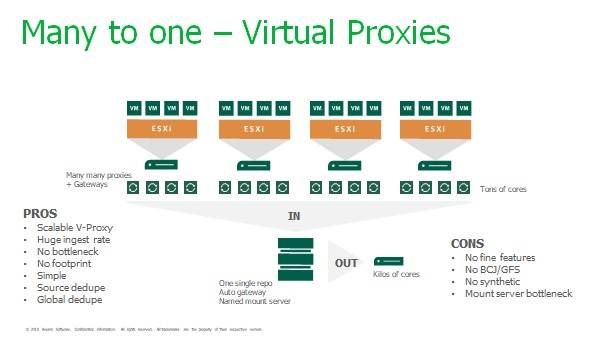
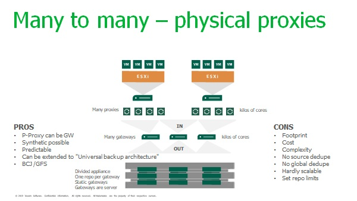

# Veeam Gateway Server

## The gateway paradigm
For any repository type that can not host the Veeam transport agent, a repository gateway must be selected which will receive data from the proxies, optionally decompress data, build the backup files and write them to storage.

The gateway selection can be static or automatic, each option presenting pros and cons as explained below but in any case the gateway selection must be studied carefully since it will impact the overall behaviour of the Veeam workload.

## Gateway compute sizing
The gateway compute can be considered as equivalent to the standard repository compute (please refer to the corresponding section of this guide for further calculation rules). A classic rule of thumb is to apply a one to one ratio against the proxy compute calculation based on the number of parallel tasks required to fulfill the backup window.

One important thing to keep in mind while sizing the repository gateway is that it might also be used to handle secondary tasks such as backup copy jobs.

A server hosting the proxy and gateway role should theorically be sized to sustain both loads. For example 1 core & 2 GB RAM proxy plus 1 core & 4 GB RAM gateway for each parallel stream (a.k.a. VMDK or VHD). In this situation a conservative rule would be 2 core and 6 GB of RAM per parallel task on the machine hosting the proxy and gateway roles but a less conservative rule can be applied if the job compression is set to "dedupe friendly" or "none". The CPU will be spared, and the rule can be set to 1 core and 4 GB RAM per parallel task.

If the gateway is not coupled with the proxy its sizing is the same than for any simple repository.

## Automatic gateway
As explained in the user's guide setting the gateway to "Automatic" means the proxy in charge of reading will supposely be elected as the gateway too. This kind of design, especially using virtual proxies, is perfectly adapted to scale-out infrastructures such as cloud or large enterprise. Virtual proxies/gateway are deployed on demand, storage APIs can leverage source deduplication on the proxies/gateways until the storage itself is fully loaded. This kind of configuration is giving outstanding performance as long as only backup or restore operations have to be used.

Automatic gateway configuration must be used with caution if backup copy job or synthetic operations are used because in such cases the mount server configured will be the only component handling these operations, potentially creating a bottleneck. This is of course also true for x86 agents backup while the backup server itself will then be elected as the gateway.

## Static gateway
A static gateway setup will allow more predictable results than an automatic gateway setup but it may not satisfy the performance needs regarding enterprise like storage due to compute limitations. For example, DataDomain or StoreOnce storage would accept thousands of parallel connections while a static repository could only serve tens of them due to CPU limitations. This is especially true if the gateway is a guest, usually limited to less than 8 cores. In such conditions the storage might be underutilized.

To overcome this limitation, a good option is to split the storage in many repositories, stacking multiple gateways in front of it.

Compared to automatic gateway, such configurations will allow the use of synthetic operations or backup copy jobs, LAN free backup but will be less flexible.

## Typical use cases
For huge scale-out configurations where only backup and restore matter, the automatic gateway deployed on virtual guests is a must in term of performances and scalability. Such configurations can easily saturate the storage with no additional physical footprint. Keep in mind that an active full might be desirable if the VBR server comes to saturation while performing synthetic operations.

Automatic gateway & proxy configuration:

If attention has to be paid on backup copy jobs, LAN free backup or if backup of agents must be intensely used, the static gateway configuration whould be preferred for its predictability.

Static gateway configuration:

## References
[User's guide](https://helpcenter.veeam.com/docs/backup/vsphere/gateway_server.html?ver=100)

[Best practice guide repository sizing](../D_backup_repositories/repositories.md )