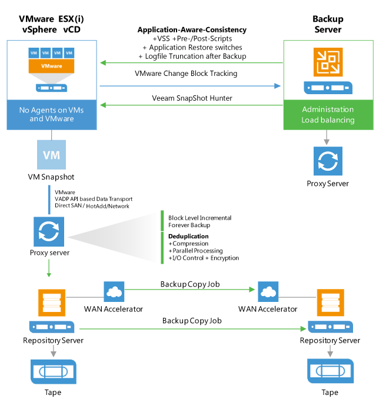

# Veeam Tape Server

## Overview

The diagram below illustrates the main components and processes within
the backup infrastructure when tape support is implemented in Veeam
Backup & Replication:

## Tape Server Sizing

For the highest throughput, enabling parallel processing for the Backup to Tape is recommended. You need to size the servers and storage connection accordingly. It can be helpful to create multiple partitions with 2-4 tape drives and add these partitions to different tape servers. Adding these libraries to the media pool and enabling parallel processing will distribute the load across multiple drives and tape servers.

Install Windows 2012 R2 or above on the tape server for best performance. Use the latest Veeam version and patch level as they often contain tape throughput optimizations.
Perform a POC to test throughput of tape and disk. If you have no opportunity to test speed, assume that the lowest speed for backup to tape jobs with LTO5/6 is 50MB/s as a conservative estimate. We highly recommend to do a POC to evaluate real throughput to avoid additional hardware costs.

The GFS (Grandfather, Father, Son) tape job can help avoid a complex Backup to Tape job creation by handling weekly, monthly, quarterly and yearly backups in a single job.
For Backup to Tape jobs that use forward incremental (without synthetic or active fulls) jobs or Backup Copy Jobs as source of the data, it may be required to temporarily disable the job using pre- and post scripts, as the transform process of forever incremental forever will terminate the tape job. Another option is to increase the restore points of these jobs temporarily. By increasing the number of restore points for the source job, the Backups to Tape job will not be terminated by the merge process. However, please note this will increase the transform time significantly once the setting is reverted and is highly discouraged for large jobs.

## References
[Tape environment](https://helpcenter.veeam.com/docs/backup/vsphere/tape_environment.html?ver=100)

[Supported devices and configuration](https://helpcenter.veeam.com/docs/backup/vsphere/tape_supported_devices.html?ver=100)
