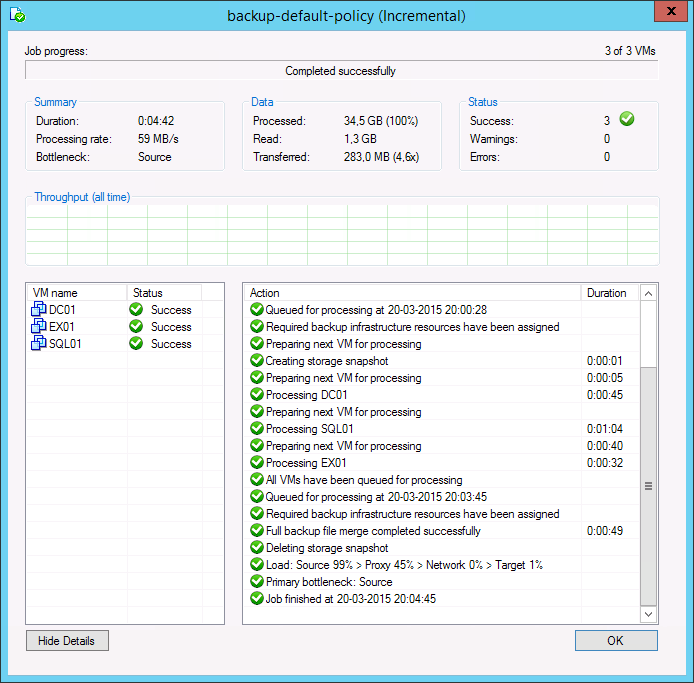
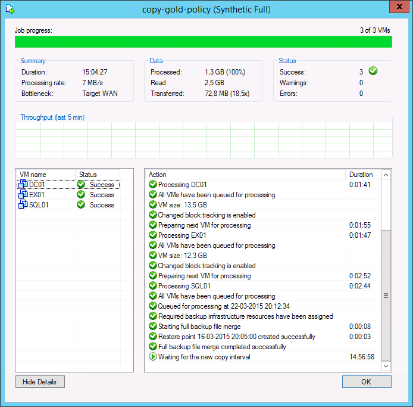

## Primary job effect

When used with Backup Copy job it is important to remember that Backup copy job works in forever incremental mode, transferring to the target repository only the differences between previous and current job cycles no matter what type of the backup file is in the primary repository: Full or Incremental. 
WAN accelerators efficiency highly depends on the source job backup mode,  thus it is recommended review the backup mode used on the primary backup job. Some backup methods result in a random I/O workload on the source repository (as opposed to sequential I/O patterns in other backup modes). Thus, the retrieval of needed blocks takes longer. The methods of reading from source is illustrated by the figure below:

For example, forward incremental and forever forward incremental methods will make backup copy jobs work much faster, as read operations will be sequential rather than random.
To avoid similar fragmentation and random I/O on forward incremental modes, keep backup storage maintenance enabled when possible.
Though a workload penalty may not be significant, it can be a good idea to monitor the storage latency on the backup repository, especially if the reported bottleneck is Source. If the storage latency on the backup repository is high, it is recommended that you change the backup mode in order to increase the throughput of one pair of WAN accelerators.

* Once the target WAN accelerator is deployed, it is recommended to use the cache population feature (see this section of the User Guide for details). When using this feature, the WAN accelerator service will scan through selected repositories for protected operating system types. 

* It is also possible to seed the initial copy of data to the target repository to further reduce the amount of data that needs to be transferred during the first run. 

## Analyzing WAN accelerators efficiency

**Analyzing Backup Job**

During both full and incremental job sessions, three metrics are displayed in the session data: Processed, Read and Transferred. To better understand the difference between direct data transfer and WAN accelerated mode, examine the **Read** and **Transferred** values:

* **Read**— amount of data read from the production storage prior to applying any compression and deduplication. This is the amount of data that will be optimized by the WAN accelerator. 

* **Transferred** — amount of data written to the backup repository after applying compression and deduplication. This is the amount of data that will be processed by the backup copy job running in Direct Transfer mode (without WAN acceleration), assuming all VMs from the backup job are included in the backup copy job. 

**Analyzing Backup Copy Job**

When analyzing a backup copy job you can see the same metrics in the job session Data: Processed, Read and Transferred. Comparing the backup copy job with WAN acceleration enabled and the backup job, it is possible to correlate the information in both outputs.

* The amount of **Processed** blocks in the backup copy job session is equal to the amount of **Read** blocks in the backup job session. This is the most important metric, as it is the amount of data that has to be processed by the WAN accelerator. 

* The number of **Read** blocks for the **backup copy job** is typically higher than the amount of **Processed** - this is due to the backup copy job using a differing fingerprinting algorithm that works with a different block size compared to the fingerprinting algorithm and block size used by **backup jobs** that created the original backup file. For this reason, this metric can be ignored.

* The amount of **Transferred** data is the amount of data actually transferred over the WAN link.
Comparing WAN Acceleration Modes

Consider that the savings rate (18.5x) displayed in the GUI is based on **Processed** data ("re-hydrated" data blocks). In the example above, 283 MB would have been transferred over the WAN link in Direct Transfer mode, while only 72.8 MB were transferred after enabling WAN acceleration. The actual savings rate equals 3.9x in this relatively static demo infrastructure, whilst it would typically be significantly higher in real-life scenarios.

**Note**: Approximate savings ratio can be assumed as of 10x.
To calculate possible savings and needed bandwidth you may use the following calculator Bandwidth Calculator.

