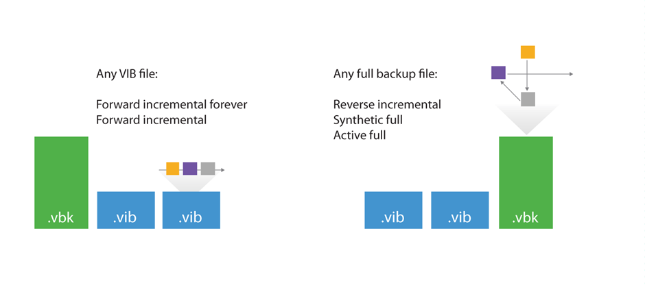
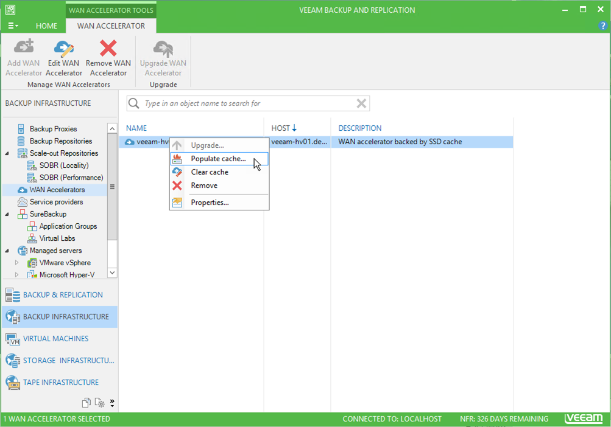

When used with Backup Copy job it is important to remember that Backup copy job works in forever incremental mode, transferring to the target repository only the differences between previous and current job cycles no matter what type of the backup file is in the primary repository: Full or Incremental. 
WAN accelerators efficiency highly depends on the source job backup mode,  thus it is recommended review the backup mode used on the primary backup job. Some backup methods result in a random I/O workload on the source repository (as opposed to sequential I/O patterns in other backup modes). Thus, the retrieval of needed blocks takes longer. The methods of reading from source is illustrated by the figure below:

For example, forward incremental and forever forward incremental methods will make backup copy jobs work much faster, as read operations will be sequential rather than random.
To avoid similar fragmentation and random I/O on forward incremental modes, keep backup storage maintenance enabled when possible.
Though a workload penalty may not be significant, it can be a good idea to monitor the storage latency on the backup repository, especially if the reported bottleneck is Source. If the storage latency on the backup repository is high, it is recommended that you change the backup mode in order to increase the throughput of one pair of WAN accelerators.

* Once the target WAN accelerator is deployed, it is recommended to use the cache population feature (see this section of the User Guide for details). When using this feature, the WAN accelerator service will scan through selected repositories for protected operating system types. 

* It is also possible to seed the initial copy of data to the target repository to further reduce the amount of data that needs to be transferred during the first run. 

