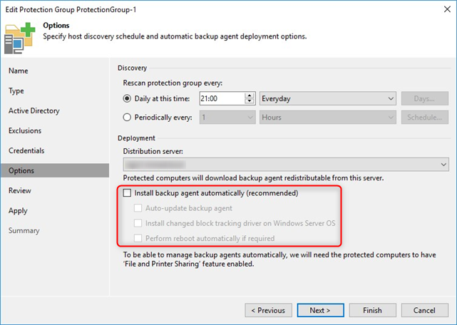

# Agent Management

Veeam Agents provide the ability to backup and restore workloads which prohibit the use of a virtual machine backup (e.g. physical computers, public cloud vms, vms which snapshots cannot be created for). Starting from version 9.5 Update 3, Veeam Backup & Replication lets you centrally deploy and manage *Veeam Agent for Microsoft Windows* and *Veeam Agent for Linux* on computers in your infrastructure from within the Veeam Backup & Replication console.

The central management of Veeam Agents involves additional elements in the console:

- **Protection Group** - Container in the Veeam Backup & Replication inventory aimed to combine protected computers (e.g. by type or workload etc.)
- **Agent Backup Job** - Runs on the backup server in the similar way as a regular job for VM data backup. One job can be used to process one or more Protection Groups and/or individual computers.
- **Backup Policy** - Describes configuration of individual Veeam Agent backup jobs running on protected computers (in contrast to Agent Backup Jobs running on the backup server). Settings from a Backup Policy can be applied to one or more individual computers or computers added to the inventory as part of a Protection Group.

For detailed descriptions of the purpose, setup, usage and behavior of these elements please refer to the [Veeam Agent Management Guide].

## Protection Groups
The purpose of Protection Groups within Veeam Backup & Replication is to specify computers on which Veeam Agents should be installed and managed. The selection of computers within a particular Protection Group can be based either on individual IP addresses, Microsoft Active Directory objects (entire domain, container, organizational unit, group, computer or cluster) or computers listed in a CSV file. Each Protection Group requires a unique name for display under the "Physical & Cloud Infrastructure" node on the Inventory page of the Backup & Replication console. Additionally, there are predefined Protection Groups (manually added, unmanaged, out of date, offline, untrusted). For details please refer to the [Veeam Agent Management Guide].

### Discovery / Rescan
Within each manually created Protection Group there are two configuration options within the Protection Group's configuration dialog that should be reviewed carefully:

- Checkbox: Install backup agent automatically (plus sub-options on the "Options" page of the dialog)

- Checkbox: Run discovery when I click Finish (on the "Summary" page of the dialog)

Both checkboxes are ticked by default which leads to the installation of Veeam Agent components on the computers targeted by the Protection Group as soon as the wizard dialog is closed by clicking the Finish button. This is due to the fact that a rescan job is started directly after finishing the dialog and the "Run discovery" checkbox was ticked. This job updates the Protection Group's member list based on the chosen method and then connects to each computer in the list to deploy the Veeam Installation Service on each newly discovered computer. Then, based on the "Install backup agent automatically" setting and its sub-options, additional software components will be installed on the targeted computers.

In enterprise-grade environments with usually very strict software deployment/maintenance rules and processes, it is very likely that an automatic installation of software components on a number of computers does not comply to such regulations when executed this way.

As a best practice it is recommended to carefully review and uncheck these options as needed whenever the Protection Group configuration is committed by clicking the "Finish" button. It might also be desirable to disable the recurring, scheduled rescan of Protection Groups as described [here][Disable Protection Group].

## References
- [Veeam Agent Management Guide]

<!-- referenced links -->
[Veeam Agent Management Guide]: https://helpcenter.veeam.com/docs/backup/agents/index.html
[Cluster-Support]: https://helpcenter.veeam.com/docs/backup/agents/cluster_support.html
[Disable Protection Group]: https://helpcenter.veeam.com/docs/backup/agents/protection_group_disable.html
