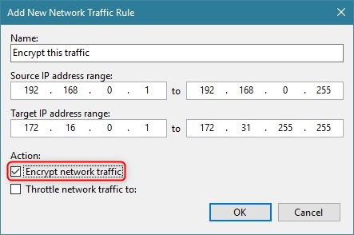

# Network Transport Encryption

## What does it do?
Unlike the backup and tape job encryption features, the network transport encryption feature is designed to protect data "in-flight". For example, when the proxy is sending data across the network to the backup repository, data can be encrypted between these two points even if job-level encryption has not been enabled. This is primarily useful when the network between the source and target is not trusted, for example, when sending data across the Internet.

## How does it work?
Network encryption in Veeam Backup & Replication is controlled via the global [Network Traffic Rules].



Whenever two backup infrastructure components need to communicate with each other over the IP network, a dynamic key is generated by the backup server and communicated to each node over a secure channel. The two components then establish an encrypted connection between each other using this key, and all communications between these two components for that session are then encrypted with this key. The key has a one-time use and it's discarded once the session is completed.

## When to use it?
Network transport encryption should be used if the network between two backup infrastructure components is untrusted or if the user desires to protect Veeam traffic across the network from potential network sniffing or "man in the middle" attacks.
By default, Veeam Backup & Replication automatically encrypts communication between two nodes if at least one has an interface configured (if used or not) that is not within the range of "Private Internets" as defined by [IETF RFC 1918]. Veeam also automatically uses network-level encryption for any connection with Veeam Cloud Connect service providers. However, Cloud Connect establishes a TLS 1.2 encrypted tunnel to the service provider in a different way. To learn more about specific Cloud Connect encryption mechanism, watch this YouTube video: [How Veeam Cloud Connect Encryption works]

## Best Practices
- Enable encryption if network-level attacks are a security concern.
- Network-level encryption can use significant CPU resources, especially on the encrypting side (source) of the connection. Make sure that component nodes have enough resources. Modern CPU's can offload encryption and reduce the amount of CPU resources required. For Intel CPUs specifically, you may check your CPU model on Intel ARK and look for the AES-NI capability.
- Use network-level encryption only where required. If backup infrastructure components are running on a network that is using non-RFC1918 IP addresses but is still private and secure from attacks, consider using the following registry key to disable automatic network-layer encryption:
```
  Path:  HKEY_LOCAL_MACHINE\SOFTWARE\Veeam\Veeam Backup and Replication
  Key:   DisablePublicIPTrafficEncryption
  Type:  REG_DWORD
  Value: 1 (default: 0)
```
----

## References
- [Network Traffic Rules]
- [IETF RFC 1918]
- [How Veeam Cloud Connect Encryption works]

<!-- referenced links -->
[Network Traffic Rules]: https://helpcenter.veeam.com/docs/backup/vsphere/network_rules.html
[IETF RFC 1918]: https://tools.ietf.org/html/rfc1918
[How Veeam Cloud Connect Encryption works]: https://www.youtube.com/watch?v=yGuw37PxRHU
