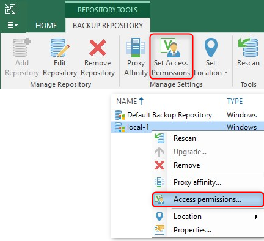
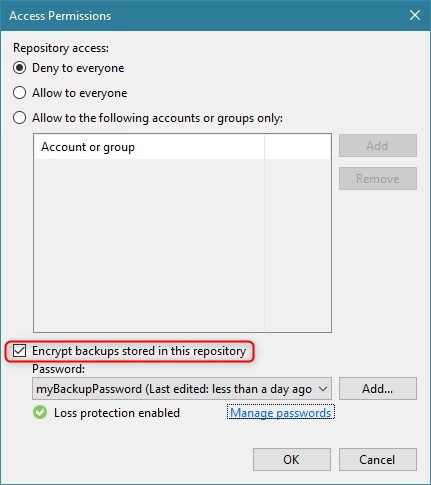
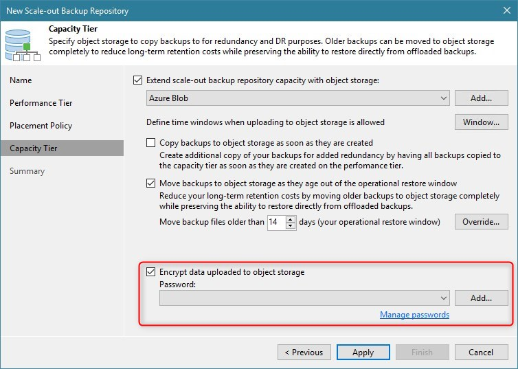

# Backup Repository Encryption

Within the Veeam Backup & Replication console's repository toolbar, there is button named "Set Access Permissions". The same command can also be found by opening an existing repository's context menu:

Both open a dialog where not only access permissions but also encryption can be configured for the selected repository:

It is very important to understand that enabling encryption in this dialog does **_NOT_** lead to a configuration where all backups targeting this repository will be encrypted! Instead, this setting **only applies to Veeam Agent backups** targeting this repository and not controlled by the Veeam backup server, i.e. Agents in unmanaged *standalone mode*. Any backup job configured on the backup server (for Veeam Agents as well as for VMs) will **always** use the backup job's encryption settings and will **ignore** the repository encryption configuration made in this dialog (see also corresponding [Veeam Help Center page][Repository Access Permissions]).

## Object Storage Repository Encryption in Capacity Tier
When creating or configuring an object storage repository within Veeam Backup & Replication, there is no option to enable encryption of data going into this repository. However, as soon as such an object storage repository is added as [Capacity Tier] to a Scale-out Backup Repository (SOBR), you will find the encryption setting in the corresponding Capacity Tier settings of the SOBR:

By enabling this setting and providing an encryption password, all backup data offloaded or copied to the Capacity Tier's object storage target will be encrypted "at source", i.e. before being uploaded (see also [Add Capacity Tier] in the User Guide). This applies to backup data created by backup or backup copy jobs that target this SOBR regardless of the jobs' encryption settings. This also means that (via source job settings) already encrypted backup data will be encrypted again before uploaded to object storage. Be aware that this will consume additional compute resources and add performance impact, a fact that might be considered a waste of resources. That said, if Capacity Tier encryption has been disabled, backup data encrypted by the source job's settings will be uploaded unmodified to the object stroage target, thus it stays encrypted.

>**Note:** Some cloud object storage providers offer "encryption at rest" as a service where incoming data will be encrypted before being stored. Veeam Backup & Replication does **not** use any of these encryption services but instead is always performing encryption "at source" as described above.

## Best Practices
- Enable encryption for each repository where you plan to store unmanaged Agents' backup data and when this backup data is going to be moved/copied to another location outside of your security domain.
- Enable Capacity Tier encryption whenever you are not encrypting your on-premises backups (via job settings) and the targeted object storage is outside your security domain (e.g. public cloud provider storage service).
- If backups are encrypted by job settings, enabling additional Capacity Tier encryption will have a performance impact and consume extra compute resources as encryption will be performed twice.
- Best practices mentioned in [Backup and Backup Copy Job Encryption](job.md) apply just the same.

## References
- [Repository Access Permissions]
- [Capacity Tier]
- [Add Capacity Tier]

<!-- referenced links -->
[Repository Access Permissions]: https://helpcenter.veeam.com/docs/backup/vsphere/access_permissions.html
[Capacity Tier]: https://helpcenter.veeam.com/docs/backup/vsphere/capacity_tier.html
[Add Capacity Tier]: https://helpcenter.veeam.com/docs/backup/vsphere/new_capacity_tier.html
