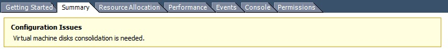

# Interaction with vSphere

Veeam Backup & Replication relies heavily on the vSphere infrastructure it is protecting. Much of
the implementation success depends on the performance and stability of this environment. In this
section, we will discuss those interactions and note the items that should be considered for a
successful implementation.

While it is possible to connect a Veeam Backup & Replication server directly to ESX(i) hosts, this
section assumes a vSphere environment with at least one vCenter Server, and that the backup server
is integrated at the vCenter Server level, as this is the best practice configuration in almost all
use cases.

## vCenter Server

Veeam Backup & Replication communicates with the vCenter Server in many operations. For this reason,
fast and stable communication between Veeam Backup & Replication and the vCenter Server is critical
to achieve a stable backup environment.

Consider some important factors:

- Problems with connectivity to the vCenter Server is one of the top reasons for failed Veeam jobs.
  Having a well-performing vCenter Server with reliable connectivity will mitigate this issue and
  provide a strong backbone for a reliable backup infrastructure.
- The vCenter Server must be reliable and always available when backup jobs are running. It must be
  able to answer queries and perform actions in a reasonable amount of time. If the vCenter Server
  performs poorly during normal operations, this should be corrected prior to implementing Veeam
  Backup & Replication.
- For larger environments, with many concurrent jobs, especially jobs that run at short intervals,
  the load on the vCenter Server can be significant. The vCenter Server must be able to handle
  increased transactional workload to prevent random job failures due to command timeouts.
- The backup server must have reliable network connectivity to the vCenter Server. It is generally
  suggested that the backup server is placed in close logical proximity to the vCenter Server, but
  this is not always the best deployment option. In cases where the backup server and vCenter Server
  must be deployed across a distance, the only real requirement is that this connection is
  consistent and reliable.
- When maintenance is being performed on the vCenter Server, best practice would dictate that all
  Veeam Backup & Replication jobs must be idle, and the Veeam Backup Service should be stopped. This
  includes applying Windows updates (if using the vCenter Server installable version), vCenter
  Server patches and upgrades, or any maintenance that would require the vCenter service to be
  restarted or the system rebooted.

## Impact of Snapshot Operations

To create VM backups, Veeam Backup & Replication leverages the VMware vSphere snapshot
functionality. The creation and removal of snapshots in vSphere creates a significant impact on the
environment what must be taken into account. This section will describe various factors that should
be considered regarding this process, and offer several techniques to minimize the impact of
snapshot operations.

As Veeam Backup & Replication leverages the snapshot technology for performing backups, you should
ensure it is possible to snapshot the virtual machine disks, since there are certain configurations
that do not support snapshots. To identify VMs that do not support snapshots, see
[VMware KB article 1025279](https://kb.vmware.com/s/article/1025279) ; you can also use
[Veeam ONE assessment reports](https://helpcenter.veeam.com/docs/one/reporter/vm_configuration_assessment.html)
to automatically detect them before starting Veeam Availability project.

### Snapshot Creation

The actual operation of creating a snapshot generally has only a minor impact: the snapshot file has
to be created, and there is a very short “stun” of the VM. This “stun” is generally short enough
(typically, less than 1 sec), so it is rarely an issue except for the most time-sensitive
applications.

**Note**: Veeam Backup & Replication leverages a standard VM snapshot for the backup process.
These VMware snapshots have a single file size limitations. Keep in mind, that the maximum file size
include all snapshot files and the data disk in total. For example if you have an old VMFS version 3
the maximum file size (including snapshots) is 2TB and so your data disk should not be sized over
1.98TB to still be able to create snapshots. For details, see
[VMware KB article 1012384](https://kb.vmware.com/s/article/1012384).

### Snapshot Open

Simply having a snapshot open for a running VM involves some performance penalty on the VM, the
ESX(i) host and the underlying storage. The host has to track the I/O, split writes to the snapshot
file and update the snapshot file metadata. This overhead, in turn, impacts the guest (primarily,
with slower I/O).

This is generally most notable for VMs with significant write load, and has less impact on read
performance.

From the storage perspective, VMs running with an open snapshot require additional space to store
the snapshot data, and additional I/O load on the datastore. This is generally more noted on systems
with significant write I/O load.

**Note**: Refer to VMware Knowledge Base article at
[www.kb.vmware.com/kb/1035550](https://kb.vmware.com/s/article/1035550)
for information on vMotion and Storage vMotion processes performed with open snapshots.

### Snapshot Removal

Snapshot removal is the step with the highest impact from the performance perspective. I/O load
increases significantly, due to the extra R/W operations required to commit the snapshot blocks back
into the original VMDK. This eventually leads to the VM “stun” required to commit the final bits of
the snapshot. The “stun” is typically a short pause usually only a few seconds or less, when the VM
is unresponsive ("lost ping"), while the very last bits of the snapshot file are committed.

VMware vSphere uses the "rolling snapshot" for older versions and the same method as storage vMotion
uses starting from vSphere 6.0u1 to minimize the impact and duration of the stun.

For detailed explanation of snapshot removal issues, see
[VMware KB article 1002836](https://kb.vmware.com/s/article/1002836).

## Snapshot Hunter

At Veeam Support, one of the most commonly raised support cases was for orphaned snapshots. Orphaned
snapshots were caused by VMware’s own failed snapshot commit operations due to unreleased VMDK file
locks during VDDK operations. Veeam uses the VMware standard VM snapshot processing for backup and
replication processes, so although Veeam was not the origin of the orphaned snapshots, as Veeam uses
VMware snapshots, Veeam is often seen as a root cause as this issue was only discovered when a
backup failed.

If not monitored appropriately, VMware orphaned snapshots can cause many unexpected problems. The
most common problems are overfilled VM datastores, or snapshots growing so large they are impossible
to commit. This is a well-known VMware vSphere issue described in
[VMware KB article 1007814](https://kb.vmware.com/s/article/1007814). The only way to manually
remediate this issue is cloning the VM and performing a new full VM backup.

To understand the process refer to
[How Snapshot Hunter Works](https://helpcenter.veeam.com/docs/backup/vsphere/snapshot_hunter_hiw.html)
in the HelpCenter.

**Note**: Currently, the default behavior of Snapshot Hunter cannot be changed. As Snapshot Hunter
will automatically retry consolidation up to eight times, it may be inappropriate for some VMs that
require planned downtime to consolidate the snapshot manually. Such VMs should be excluded from
backup or replication jobs until the orphaned snapshots are manually removed.

If you are evaluating Veeam Backup & Replication, use the
[Infrastructure Assessment Reports](https://helpcenter.veeam.com/docs/one/reporter/vmware_infrastructure_dashboard.html)
included in Veeam Availability Suite to identify VMs with snapshots that can be affected by
automatic snapshot consolidation.
