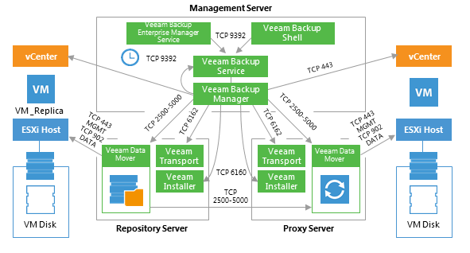
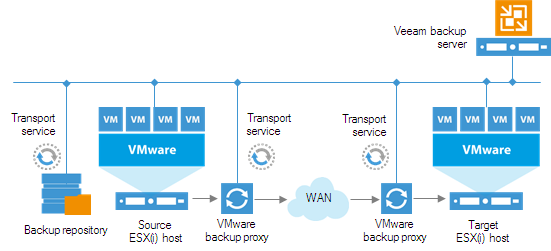

# Replication

This section provides a step-by-step description of a VMware virtual
machine replication process implemented in Veeam Backup & Replication.

In many aspects, the replication initialization phase is similar to the
initialization phase of the backup process. Veeam Backup & Replication
starts the necessary processes, builds the list of VMs to replicate,
assigns backup infrastructure resources for the job and starts Veeam
Data Movers on two backup proxies (source and target) and the backup
repository that is used for storing replica metadata.

Next, Veeam Backup & Replication performs in-guest processing tasks,
triggers VM snapshot creation, registers a replica VM on the target host
and performs data transfer from the source host and datastore to the
target host and datastore. The source and target proxies can use one of
3 available data transport modes for reading data from source and
writing data to target.

This diagram illustrates the replication process with the NBD transport
mode used for reading and writing VM data. For examples of the Direct
SAN/NFS Access and HotAdd transport modes, see the “Backup Anatomy” section
above in this Appendix.

Note that Veeam uses backup repository to store replica metadata.

The following diagram illustrates a possible placement of the Veeam
Backup & Replication components in a distributed environment, with a WAN
link between the production and DR sites.

