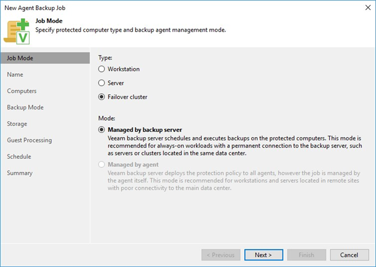

# Veeam Agent for Microsoft Windows

## Agent for Windows Types
Veeam Agent for Windows is available in two different versions, depending on the way how the agent's backup is managed: A lightweight version and a full version.

The leightweight version does not include a local database or any GUI elements so it cannot be managed on the local agent computer. The full version utilizes a local *Microsoft SQL Server 2012 Express LocalDB Edition* (automatically installed) and installs a set of applications with local user interfaces for creating and managing backup and restore jobs. However, these user interfaces become restricted (i.e. most settings cannot be changed locally) as soon as the agent is under control of a backup policy of a Backup & Replication server (i.e. the agent computer belongs to a Protection Group which is assigned to a backup job in _"managed by agent"_ mode). Details about system requirements and components installed as part of the Veeam Agent package can be found in the [Veeam Agent Management Guide].

The following table shows the relationships between agent types and management scenarios.

| **Management Scenario** | Full Backup Agent | Lightweight Agent |
| --- | :---: | :---: |
| *Distributed and managed by Backup Server* |  |  |
| - Backup job mode: Managed by backup server |  | X |
| - Backup job mode: Managed by agent (= Backup Policy) | X |  |
| *Standalone mode* |  |  |
| - manual install, no VBR server | X |  |

More details about Agent for Windows management modes and related components can be found in this white paper: [Physical Servers Backup with Veeam: Best Practices and Configuration][VAW Whitepaper]

## Agent Support for Microsoft Failover Clusters
Veeam Agent for Windows supports backup and restore of Microsoft Failover Clusters which can be targeted by selecting the type "Failover cluster" on the "Job Mode" page of the agent backup job configuration dialog.

As shown in the screenshot above, a backup job of type "Failover cluster" cannot be configured to be "Managed by agent". This is due to the fact that only the lightweight agent version is supported on failover clusters. Additionally, a Protection Group assigned to a backup job of type "Failover cluster" must be of type "Active Directory objects" and the desired cluster object from Active Directory needs to be added to it, either directly or via an object which contains the cluster object (i.e. group or organizational unit). This also allows processing of more than one failover cluster in a single backup job.

For further requirements, limitations, supported cluster configurations and -workloads see the [Cluster Support Section][Cluster-Support] of the Agent Management Guide.

### Backup Processing of Cluster Disks
When an Agent backup job targeting a failover cluster is executed, all cluster nodes are processed in parallel (with respect to the concurrency settings configured for the proxy and repository servers involved). However, if one node owns more than one cluster disk at the time of the backup run, the cluster disks owned by this node will be backed up in sequence. On the repository server, each cluster node consumes one task slot during backup processing.

>**Note**: If the owner of a cluster disk changes while the disk is in the process of being backed up, the corresponding backup job will fail.

## References
- [Veeam Agent Management Guide]
- [Cluster-Support]
- [Physical Servers Backup with Veeam: Best Practices and Configuration (Veeam white paper)][VAW Whitepaper]

<!-- referenced links -->
[Veeam Agent Management Guide]: https://helpcenter.veeam.com/docs/backup/agents/index.html
[Cluster-Support]: https://helpcenter.veeam.com/docs/backup/agents/cluster_support.html
[VAW Whitepaper]: https://www.veeam.com/wp-physical-servers-backup-best-practices-configuration.html
