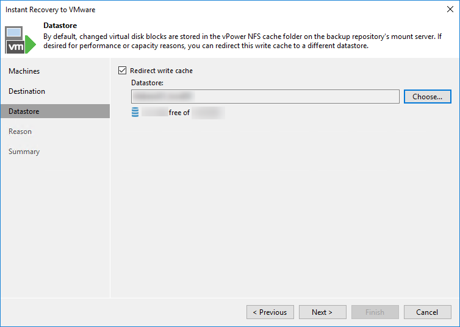
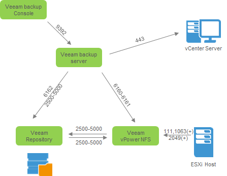

# Instant Recovery to VMware vSphere

With Veeam Backup & Replication v10 the Instant Recovery has been further enhanced: now it is possible to start multiple Instant Recovery sessions directly from the VBR console and it is possible to use this feature along with **any** Veeam backup, including Veeam Agents, Hyper-V VM's, Nutanix AHV VM's as well as cloud native backups from Veeam Backup for Azure and AWS.

## Planning the resources

Usually reserved for the guests requiring the best possible RTOs, the Insant Recovery process is read intensive and its performance is directly related to the performance of the underlying repository.

Very good results can obtained from standard drive repositories (sometimes even offering faster boot time than the production guest) while deduplication appliances might be considered carefully for such kind of use. Keep in mind that when working on its backup files to start the guest, Veeam Backup and Replication needs to access the metadata, which is generating some random small blocks read pattern on the repository.

### Write redirections

Once booted, the guest will read existing blocks from the backup storage and write/re-read new blocks on the configured storage (whether being a datastore or a temporary file on the Veeam Mount Server local drive in the folder `C:\ProgramData\Veeam\Backup\IRCache\`).

To ensure consistent performance during the IVMR process, it is recommended to redirect writes on the same datastore where the instant-restored VMs will be eventually moved. This will not only improve the performance of the restored VM but it will also reduce the network traffic going through the Veeam Mount Server.

Redirecting the write cache on the target datastore will also reduce the amount of free space that needs to be free on the Mount Server as the .vswp (virtual machine swap file) will be created on the datastore. When planning a multiple Instant Recovery or powering on a VM configured with a high amount of RAM, this can make a huge difference since the swap file has the same size as the guest OS' memory.

**When write cache is not used** the amount of free disk space on the Veeam Mount Server must be equal to the total RAM size of the VM's for which the Instant Recovery has been issued plus a 10% of their disks size to store all the changes.

## Finalizing the process

The Instant Recovery process is a temporary state that requires to be finalized. The options available are:

- Use VMware Storage vMotion to migrate the restored VMs to the desired datastore without any downtime
- Use a replication job to create an additional copy of the restored VM and plan a failover at a later time or during the next maintenance window
- Use Veeam [Quick Migration feature](https://helpcenter.veeam.com/docs/backup/vsphere/quick_migration.html), if VMware Storage vMotion is not available
- Undo the process: the restored VM will be unpublished without any change to the original restore point

## Netork ports

Below the network ports required to the Instant VM Recovery and the communication flow between all the components involved:

