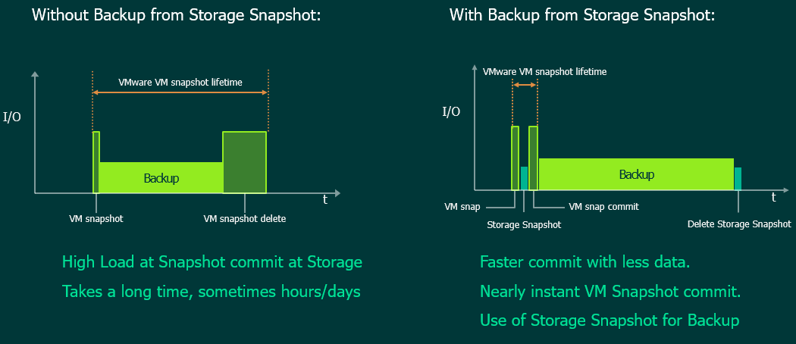
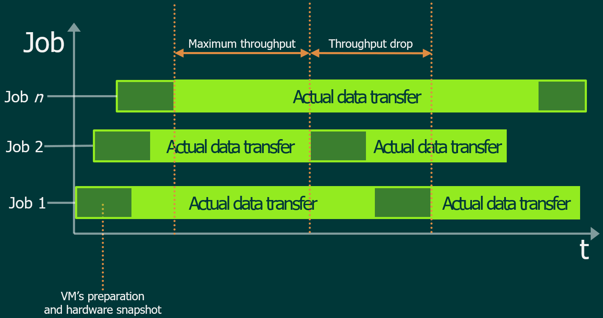
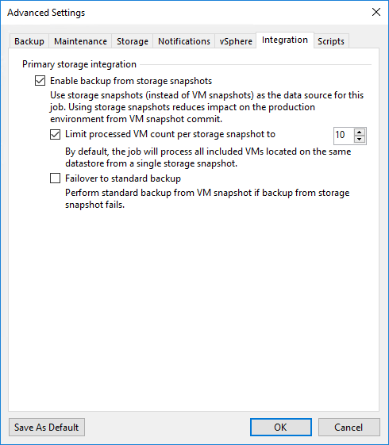
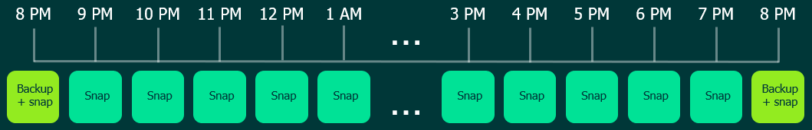

# Storage Integration

Veeam Backup & Replication is completely hardware agnostic, however it does integrate with some specific storage system to leverage the capabilities of native hardware snapshots.

The integration, for some systems, goes beyond the use of hardware snapshots to read data during the backup and replication operations and allows users to orchestrate the creation of hardware snapshots, that will be stored within the same storage or copied to a secondary system of the same type.

For the complete list of the supported storage, refer to the [Integration with Storage Systems](https://helpcenter.veeam.com/docs/backup/vsphere/storage_integration.html) from the user guide.

## Introduction

Hardware snapshots can be used to reduce the impact on the virtual infrastructure during the backup and replication operations, as well as primary restore point to increase the RTPO.

When reading data from an hardware snapshot, Veeam Backup & Replication leverages its own *Advanced Data Fetcher* to speed up the transfer rate. This something to keep in mind as it's one of the main differentiator between the **backup from storage snapshot** and **direct SAN** transport mode.

Based on the protocol used by the storage system underneath, a physical Veeam proxy may be required.

## When to use

Knowing that using backup from storage snapshot significantly reduces the time that the vSphere snapshot has to grow, as it is shown in the following picture:

Backup from storage snapshot is not always recommended as it increases the number of tasks that a backup job must go through before start processing data: a vSphere snapshot of all the VMs that are part of the job must be taken before creating the actual hardware snapshot.

The first thing to consider when it comes to decide whether to use backup from storage snapshot or not is the average load of the VMs to be protected during the backup window, as well as if the appliction running on it is sensitive to snapshot stuns.

To properly make a good use of this feature, we recommend using backup jobs based on datastores as they represent the entity that provides either an high number of VMs grouped together and avoid a snapshot storm on the underneath storage array: no more than a single hardware snapshot at a time will exist for a given LUN during the backup execution.

Scheduling also plays a crucial role when it comes to this backup mode: as mentioned above, since all the VM's have to be quiesced before creating the hardware snapshot, to guarantee a sustained throughput multiple backup jobs must run concurrently.

As it is shown in the picture above, jobs should start within an interval of 5 minutes one to the next and, in the advanced options, the option to limit the number of VMs to processed within a single hardware snapshot should be set to 10 or less (depending on how many concurrent jobs will run).

Limiting the number of VMs within an hardware snapshot is key to reduce the time in which the vSphere snapshot is open to a minimum thus reducing the impact on the VMs. Without this option enabled, the job will quiesce first all the VMs before creating the hardware snapshot and, if the job has to process an high number of VMs, the vSphere snapshot of the first ones processed may grow considerably.

## Snapshot-only job

Using snapshot-only job is like scheduling automatic snapshots creation in the storage management console. That job produces a snapshot that is stored within the same storage array and controls frequency and retention of that chain of restore points. No additional backup file will be saved in the backup repository: the snapshot chain is self-consistent and provides the same recovery capabilities as if it was a regular backp file.

Depending on the backup job settings, the created snapshots can be application-consistent or crash-consistent. If application-aware image processing is enabled, during the job session, Veeam Backup & Replication will interact with the guest OS creating a vSphere snapshot and proceeds as it does for normal backup jobs. Right after this step, the hardware snapshot is created.

Regardless the consistency of the snapshot, we do recommend to include snapshot-only jobs as part of your data protection strategy, especially for the most critical VMs hosted in your virtual infrastructure. The overhead generated by this type of job is very little compared to the standard backup process and modern storage systems make use of smart ways to store these snapshosts efficiently, reducing the space needed to store them to the bare minimum.

Also, applications like Microsoft SQL and Exchange can use these Snapshot only jobs to create a snapshot chain for fast recovery and increase the protection level by generating restore points, at a very low cost in terms of impact and consumed space, even outside the usual nightly backup window.

