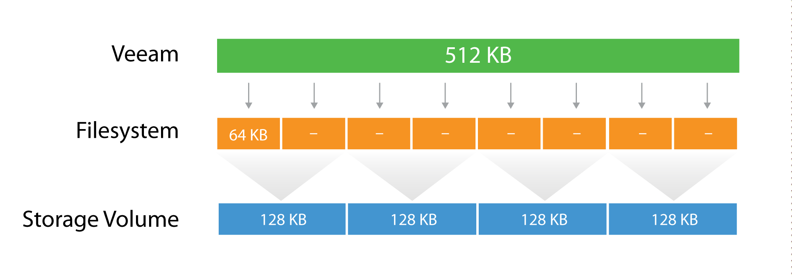
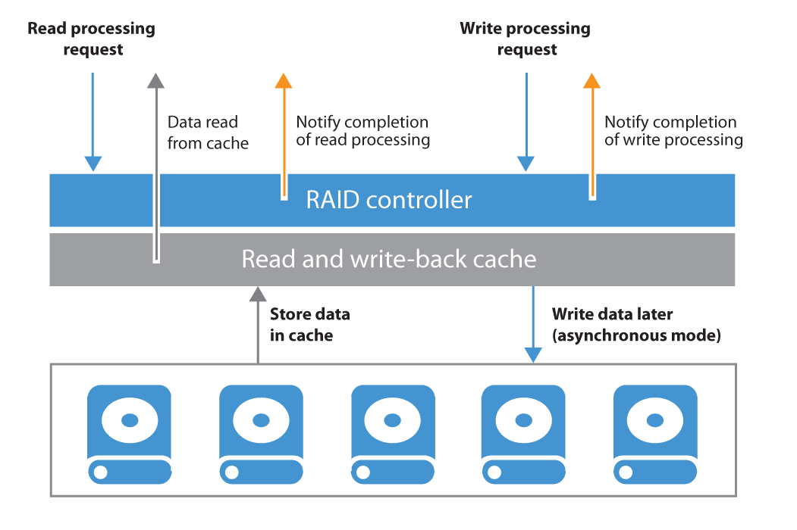

# Block Repositories

These kind of repositories do provide provide a block storage device to a Windows or Linux
repository server. A block storage device can be a local disk (**D**irect **A**ttached
**S**torage) or a LUN provided via a **S**torage **A**rea **N**etwork like iSCSI or Fibre Channel.

## DAS or SAN?

### Direct-Attached Storage (DAS)

This is an easy, fast and lowcost way to use storage. It is a new approach to use microsegmentation
instead of monolithic solutions. The DAS approach is in terms of performance a very fast solution.
It can be used as a dedicated system to one cluster or in a Scale-out Backup Repository. DAS is a
normal industry standard x64 server with a bunch of disks attached to it.

- It is recommended to use a performant RAID controller with local battery cache. Be aware of any
  RAID overhead when designing a DAS soltuion. Typically RAID 6/60 (depends on the amount of disks) is
  recommended (IO overhead of factor 6). The stripe size should be 256KB or greater.
- Since a DAS storage can be fully dedicated to backup operations, this type of repository is
  considered to offer a good balance between “performance” and “cost” factors.
- A strong benefit of a DAS repository is that it supports the features offered by Veeam Backup &
  Replication in a very flexible way. In particular, it provides good read and write performance,
  sufficient for Veeam vPower-based features (such as Instant VM Recovery, SureBackup, and others).
  As it typically provides good random I/O performance, it will be the optimal solution when using I/O
  intensive backup modes such as reverse incremental or forever forward incremental (also used in
  backup copy job).
- For scalability you can scale vertical (more disks in an enclosure or additional) and horizontal
  (more servers, if e.g. the network throuput is reached, the SAS channels are saturated, more IOPS
  are needed for restore reasons)

**Tip:** When using Microsoft based repositories, use the RAID controller, to build the RAID set and
set the stripe size there. Don't use any kind of software or HBA based RAID level.

| Pros             | Cons                                         |
| :--------------- | :------------------------------------------- |
| Cheap            | RAID Controller is a single point of failure |
| High performance |                                              |
| Simplicity       |                                              |
| Microsegmentaion |                                              |

### SAN Storage

This is an advanced and manageable solution that offers the same advantages as DAS, and adds more
advantages like higher availability and resiliency.

The volume size and quantity are easily adjustable over time, thus offering a scalable capacity.

**Tip**: You can configure multiple backup repositories on the SAN storage to increase repository
throughput to the storage system.

| Pros                   | Cons                |
| :--------------------- | :------------------ |
| Reliability            | Complexity          |
| Performance            | Expensive           |
| Technical capabilities | Monolithic approach |

## Block Sizes

As can be seen from the field, optimal value for the stripe size is often between 128 KB and
256 KB. However, it is highly recommended to test this prior to deployment whenever possible.

During the backup process data blocks are processed in chunks and stored inside backup files in the
backup repository. You can customize the block size during the Job Configuration using the Storage
Optimization setting of the backup job.

By default block size is set to Local Target, which is 1 MB before compression. Since compression
ratio is very often around 2x, with this block size Veeam will write around 512 KB or less to the
repository per block.

This value can be used to better configure storage arrays; especially low-end storage systems can
greatly benefit from an optimized stripe size.

There are three layers where the block size can be configured: Veeam block size for the backup
files, the filesystem, and the storage volumes.

Let's use a quick example:

The Veeam block size of 512KB is going to be written in the underlying filesytem, which has a block
size of 64k. It means that one block will consume 8 blocks at the filesytem level, but no block will
be wasted, as the two are aligned. If possible, set the block size at the filesytem layer as close
as possible to the expected Veeam block size.

Then, below the filesytem there is the storage array. Even on some low-end storage systems, the
block size (also called stripe size) can be configured. If possible, again, set the stripe size as
close as possible to the expected Veeam block size. It's important that each layer is aligned with
the others, either by using the same value (if possible) or a value that is a division of the bigger
one. This limits to a minimum the so called **write overhead**: with a 128KB block size at the
storage layer, a Veeam block requires 4 I/O operations to be written. This is a 2x improvement
compared for example with a 64KB stripe size.

For more information, refer to [this blog post at virtualtothecore.com](https://www.virtualtothecore.com/veeam-backups-slow-check-stripe-size/)

## Volume Sizes

In general we recommend to not size volumes larger than 200TB. 

This helps keeping failure domains small and managable. To go for bigger repositories we recommend
using a [Scale-Out Backup Repository](./scaleout.md) with multiple extents.

## RAID Controller Caching
To get the best out of a synthetic backup and enhance the performance, it is recommended to use a 
write-back cache. Read and write request processing with write-back cache utilization is shown in 
the figure below.

## Windows or Linux?

There are only small differences between Linux and Windows which result from using different
schedulers for I/O and compute. The main difference for block-based repositories is the choice of
available file systems.

## NTFS or ReFS?

You can use both filesystems from Microsoft as filesystem for a Veeam Repository. Both filesystems
have different behaviour during different backup situations.

ReFS allows to use the Veeam [Fast Clone](https://helpcenter.veeam.com/docs/backup/vsphere/backup_repository_block_cloning.html)
feature which allows very fast synthetic operations for full backups and merges.

On the downside this can result in random I/O, e.g. when reading a synthetic full backup file
because the data blocks are distributed over the disk. Random I/O profiles on spinning disks will be
much slower than sequential I/O. That way, e.g. a full VM restore from a full backup file might be
slower from ReFS than from NTFS when using the same disk layout.

To work around this fragmentation you can schedule regular active full backups, but they will
require 100% space on the disk compared to synthethic fulls.

### NTFS

When using NTFS pleas make sure that

- the volume is formatted with 64KB block size
- you use the "Large File" switch `/L` to format the volume to avoid file size limits

The following command will quick format volume `D` accordingly: `format D: /FS:NTFS /L /A:64K /Q`

### ReFS

ReFS is using linked clone technology. This is perfect for synthetic operations and will save
dramatic IOs and throughput during operations like merges or creating synthetic fulls.

Follow the following best practices when using ReFS:

- Format the volume with 64KB block size
- Check https://docs.microsoft.com/en-us/windows-server/storage/refs/refs-overview
- Configure 256 KB block size on LUNs (Storage or RAID controller)
- Never bring linked clone space savings into your calculation for required storage space
- "All ReFS supported configurations must use Windows Server Catalog certified hardware” - please
  contact your hardware vendor
- Never use any shared LUN concept with ReFS and a Veeam Repository
- Check the existing driver version of ReFS. The minimum should be `ReFS.sys 10.0.14393.2097`
- ReFS will flush metadata during synthetic processes to the disk very pushy. These meta data
  flushes are based on 4KB blocks. Your controller and disk system should be able to handle these OS
  related system behaviours.

## Windows Server Deduplication

Deduplication will take away some of the benefits of block storage repositories but provides
efficient use of disk resources.

Follow the recommendations provided in the configuration guidelines above; here is the summary:

- Use the latest Windows version or at minimum Windows 2012 R2 and apply all patches (some roll-ups
  contain improvements to deduplication). Having most up to date system is critical for ensuring data
  safety.
- Format the disk using the command line `/L` option (for "large size file records") and 64KB
  cluster size (use parameters `/Q /L /A:64K`)
- Follow [compression and deduplication guidelines](./deduplication.md) for non-integrated
  deduplication storage.
- (For Windows Server 2016 and later) the "Virtualized Backup Server" deduplication profile is to be
  preferred ([see details in forums](https://forums.veeam.com/veeam-backup-replication-f2/virtualized-backup-server-option-for-2016-dedup-t39049.html))
- Modify garbage collection schedule to run daily rather than weekly.
- Use backup jobs configured to perform Active full with Incrementals.
- If possible, spread active full backups over the entire week.
- Check out info in Microsoft's [What's New in Data Deduplication](https://docs.microsoft.com/en-us/windows-server/storage/data-deduplication/whats-new).
  For WS2016 deduplication is "fully supported" for files up to 1TB which is not recommended
  (supported?) for WS2012. In WS2019 dedup is supported for ReFS but will only dedup the first 4TB
  of a file.
- Large files take a long time to deduplicate and will have to be fully reprocessed if the process
  is interrupted.
- Where possible, use multiple volumes. Windows deduplication can process multiple volumes using
  multi-core CPU – one CPU core per volume; see [this Techcommunity article](https://techcommunity.microsoft.com/t5/storage-at-microsoft/sizing-volumes-for-data-deduplication-in-windows-server/ba-p/425487)
  for details.)
- Configure deduplication process to run once a day, and for as long as possible.
  More information on Windows Server 2016 Data Deduplication can be found in the [Veeam forums](https://forums.veeam.com/veeam-backup-replication-f2/windows-server-2016-w-dedupe-or-dedupe-appliance-t38351.html?#p212949).
