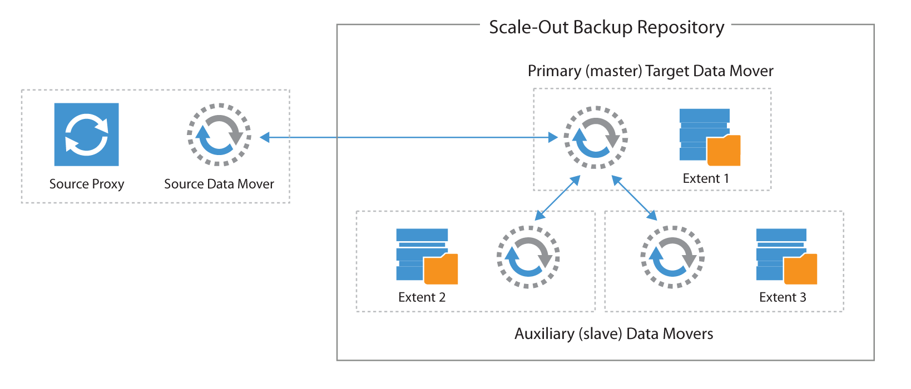

# Scale-out Backup Repositories (SOBR)

Please read the Help Center section [Scale-Out Backup Repository](https://helpcenter.veeam.com/docs/backup/vsphere/backup_repository_sobr.html)
to understand what a SOBR is as well as what its requirements and limitations are.

## Data Locality or Performance Mode?

- When using integrated deduplication devices the mode has to be configured to Data Locality to make
  use of efficient synthetic operations.
- To leverage the Performance Mode you need at least two extents
- Performance mode does increase the failure domain - a backup chain is split over at least two
  extents, thus the loss of one of the two corrupts the entire chain. This trade-off between
  increaseds failure domain and increased performance has to be evaluated case by case.

## Scale-out Backup repository and network considerations

Scale-out Backup Repository is, as the name implies, a scale out architecture, based on multiple
datamovers, with a notion of master and slave repository datamovers.

During backups, the master datamover is always started where the write is happening. During restore,
the master is always started where the VBK is located, as most blocks are likely retrieved from this
location.

A master datamover is the only repository datamover receiving data from a source datamover (a proxy
in a backup job or a source repository in a backup copy job). A master datamover is able to
communicate if needed with other slave datamovers to retrieve their data.

As in any scale-out solution, careful design should be applied to the network, as communications
between the different data movers may increase network consumption, regardless the policy in use or
the specific design of the scale-out architecture. When using Scale-out Backup Repository, 10 Gb
networks are always recommended.

## Capacity Tier

The Capacity Tier extends the SOBR virtually unlimited depending on the type of object storage
which backs the Capacity Tier.

Only one Capacity Tier can be configured per SOBR. The Capacity Tier must be an
[Object Repository](./object.md).

To understand more about the Capacity Tier and how offloading works, please refer to the
Veeam Helpcenter article about [Capacity Tier](https://helpcenter.veeam.com/docs/backup/vsphere/capacity_tier.html).

### General

The VBR 9.5 U4 implementation of Capacity Tier is a move only functionality. This means within a
SOBR the backup files do only exist once, either on a Performance or on the Capacity Tier extent.
Therefore the Cloud Tier offload functionality is not a replacement for a backup copy and is no
proper way of fulfilling the 3-2-1 rule.

The retention of the objects in the Capacity Tier is controlled by the backup or backup copy job's
retention policy in restore points and not on repository level. The operational restore window in
the SOBR configuration does only define which retention files can be offloaded.

Offloading to object storage will only happen if the retention period and the operational restore
window do overlap. E.g. if you configure 14 retention points with one backup per day and you want
to offload to the Capacity Tier after 14 days, you will never offload anything. If you configure
21 retention points with the same operational restore window there should be roughly 7 retention
points offloaded to object storage (based on other requirements, like sealed backup chains).

### Block Size

The created data-block-objects in the object storage are based on the backup's configured block size
(Storage optimizations). The default is `Local Target` and refers to an uncompressed block size of
1024 KB. Every block is offloaded as a single object in the object storage and thus requires one API
call per read or write operation (GET/PUT).

For the same amount of data a larger block size would mean less objects and less API calls, on the
other hand larger block sizes mean a higher probability of changes in the block which reduces the
efficiency of intelligent block cloning.

Experience shows that the default Local Target setting with the uncompressed 1024 KB block size is
the best general purpose setting and should be configured in most cases. In corner cases other block
sizes might show lower cost, e.g. by reducing API calls.
